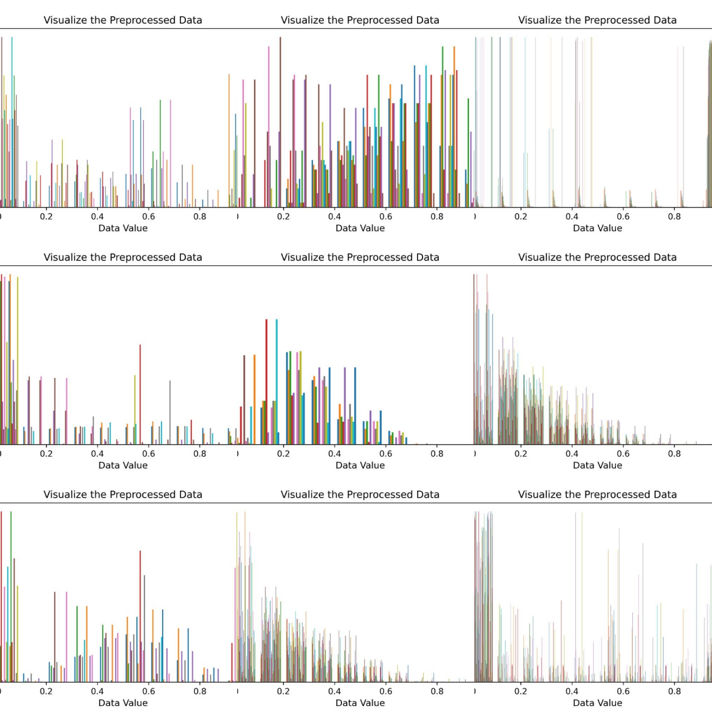

# AutoPrep
**Automated Data Preprocessing Python Package for CSV-based Clinical Data**

**پیش پردازش اتوماتیک داده های بالینی مبتنی بر فرمت CSV**


This project has been modified in the following steps on October 20, 2023:

* Step 1 [Done]: The required Python libraries will be imported.
* Step 2 [Done]: All object values in DataFrame will be encoded.
* Step 3 [Done]: All raw values in DataFrame will be normalized.
* Step 4 [Done]: All duplicate values in DataFrame will be removed.
* Step 5 [Done]: All unknown values in DataFrame will be replaced by NaN.
* Step 6 [Done]: All missing values in DataFrame will be replaced by mean.
* Step 7 [Done]: All preprocessed values in DataFrame will be reordered.
* Step 8 [Done]: All outliers in DataFrame will be removed.
* Step 9 [Done]: All values in DataFrame will be visualized.
* Step 10 [Done]: The preprocessed data will be saved as 'PreprocessedData.csv'.
* Step 11 [Done]: The feature names will be saved as 'FeatureName.csv'.

# How to install and use AutoPrep

**Install AutoPrep Python Package from PyPI**

```pip install autoprep```

**Import PreProcessCSV from AutoPrep Python Package**

```from autoprep import PreProcessCSV```

**Call the AutoPrep function with the file path as an argument**

```preprocessed_df = PreProcessCSV('data_sample/[YourDataName].csv')```

---
If you have any questions, please feel free to contact mrsaraei3@gmail.com.
